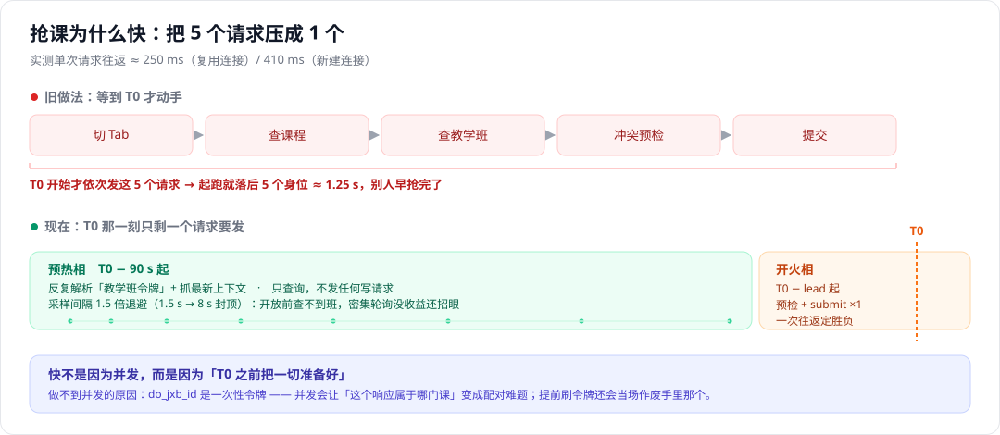
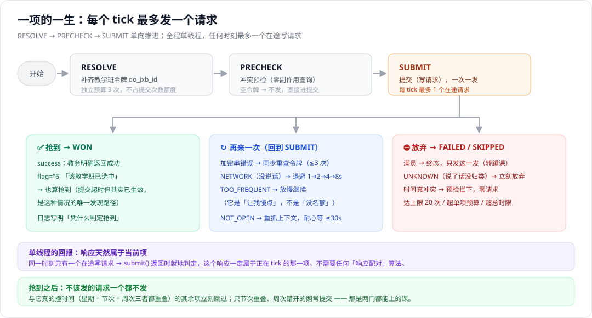

# 南苑抢课助手

一个针对**正方教务系统V-9.0**的选课/抢课工具：Python 核心 + 本地 Web 界面，全程不落盘凭据，支持预检冲突、定时开抢、盲交重试等自动化能力。

> ⚠️ 本工具默认内置**广州南方学院**的教务参数。其他学校（同样是正方教务V-9.0）可通过一份配置文件接入，见下文「接入你的学校」。

## 功能

- 账号密码登录（密码仅内存走一遍，不落盘、不上传）
- 抢课清单管理：预检时间冲突、满员改盲交、令牌自动刷新
- 定时开抢：对齐服务器时钟，T0 只发一个请求抢占先机
- 课表可视化：已抢 / 已选 / 待选三类清晰标注
- 学业情况查询、退课（按教务规则判断是否可退）
- 后台静默运行（无黑窗）+ 托盘图标 + 日志轮转

## 抢课是怎么工作的

### 一句话：快，不是因为并发

整套设计都绕着一个事实转：**教务提交用的令牌是一次性的**。

`do_jxb_id`（提交时要带的 `jxb_ids`）每查一次教学班就重新下发一个、并**当场作废旧的**（实测连查 3 次已选列表，12 门课 36 个串，0 个重复）。由此有两个绕不过去的硬约束：

1. **不能并发提交** —— 两个请求同时在飞，「这个响应是哪门课的」就退化成一道配对难题；
2. **不能提前或并行刷新令牌** —— 「刷新」这个动作本身带副作用，它会让手里那个旧令牌立刻失效。一旦刷新请求比提交先到服务器，那一发提交就是**被自己人废掉的**。

所以本工具**任何时刻只有一条线程、最多一个在途写请求**。「派发方式」（串行 / 轮流）只决定「下一个 tick 给谁」，它不是并发开关。

### 那快在哪：把 5 个请求压成 1 个

实测本校单次请求往返 ≈ **250 ms**（复用连接）/ **410 ms**（新建连接）。一次完整的选课要「切 Tab → 查课 → 查班 → 冲突预检 → 提交」，等于 5 个请求 ≈ **1.25 s** —— 等到 T0 才动手，就是起跑就落后 5 个身位。

于是定时抢课被拆成两相：

| 相 | 起点 | 干什么 | 发不发写请求 |
|---|---|---|---|
| **预热相** | T0 − 90 s | 反复解析「教学班令牌」、把上下文抓成最新的，直到全部就绪 | 否（只查询） |
| **开火相** | T0 − lead | 只剩一个 `submit`，一次往返定胜负 | 是 |

- 预热采样间隔按 **1.5 倍退避**（1.5 s 起、8 s 封顶）：开放前本来就查不到教学班，密集轮询没有收益、还容易被服务端盯上；退避后采样点天然向 T0 收拢。
- ⚠️ **预检刻意留在开火相**，不放预热相：预检判的是「与**已选**是否冲突」，而抢到第一门之后「已选」就变了，早早预检的结果会过期（自己造出来的冲突反而漏判）。



### 时钟校准：宁可早到，不可迟到

用教务响应里的 `Date` 头反推服务器时钟偏差，方法**不是**「取 RTT 最小的那一次」，而是把每个样本变成一个偏置区间再取**交集**（`Date` 只精确到整秒，单样本区间宽度 = 1 s + RTT，样本越多越窄；实测 8 次采样把不确定度从 1.2 s 收到 **±144 ms**）。

校准有两个作用：一是保证 T0 不会因为本地时钟偏差（实测数百毫秒）整轮提前或落后；二是给出**不确定度**，让上层知道该提前多少开火 —— 把残余误差推向「早到」这一无害的一侧。

> 先把期待放低：毫秒级卡点在这里没有意义。真正的杠杆是下面这句 —— **T0 那一刻只剩一个请求要发**。

### 一项的一生：tick 状态机

每一项按 `RESOLVE → PRECHECK → SUBMIT` 单向推进，**每个 tick 最多发一个请求**。

- **RESOLVE** 补齐这项的教学班令牌。有自己的重试预算（3 次），**不占用提交次数额度** —— 解析失败不该让提交少了机会。
- **PRECHECK** 时间冲突预检，零副作用的查询。令牌为空时**不发**：空令牌打过去只会换回一个「加密串错误」，白烧开火瞬间的一个 RTT。预检本身失败不致命，降级为直接提交。
- **SUBMIT** 写请求，一次一发。



### 失败不是一种东西

| 语义 | 判据 | 处置 |
|---|---|---|
| `NETWORK` | 教务**没说话**（超时 / 连接被拒） | **重试**，阶梯退避 1→2→4→8 s 封顶（高峰期主动让路） |
| `UNKNOWN` | 说了话，但没归类（例：「超过本学期最高选课学分限制」） | **立刻放弃** —— 再试还是同一句话 |
| `FULL` | 满员 | **终态失败，只打一发** |

- **满员为什么只打一发**：满员确实会变好（有人退课），但那是**小时级**；而抢课循环是**秒级**。在秒级窗口里重试，只是白烧配额。「等退课」是**蹲课**功能的活。
- `TOO_FREQUENT`（选课频率过高）刻意**保持可重试** —— 它是「让我慢点」，不是「没名额」。
- 日志必须能回答「**为什么没抢到**」：满员会把服务端下发的真实人数写出来，其他失败保留教务原文。

### 令牌刷新：先打一发，再刷

手里这个令牌先打一发（此刻没有任何人和它抢令牌）：

- 成功 → 收工，**一个刷新请求都不用发**；
- 被拒（「加密串错误」这类「请求本身被拒」的语义）→ 同步重查教学班换新令牌，再打一发。一轮最多重查 3 次。

反面做法是「提前刷好一个备用令牌」，或者两支队伍并行（一队刷新、一队打）—— 那是原理性错误：刷新先到就把自己那一发废了，等于把一场稳赢变成掷硬币。

另外两处容易被忽略的坑：

- **上下文超龄 45 s 就强制重抓**：教务在「查课期 → 未开放期 → 抢课期」之间切换会让上下文失效，不重抓就会拿着上午的令牌去打下午的教务。
- **「未开放」不是错误，是「时候未到」**：提交被本地闸门挡下（一个请求都没发）时，本工具会**耐心等**最多 30 秒（每 2 秒重抓一次上下文），而不是判死 —— 「提前十几秒点了开始、教务到点才开」恰恰是最常见的一种失手。

### 省配额：不该发的请求，一个都不发

- **互斥跳过**：某一项抢到后，清单里与它**真的撞时间**的（星期 + 节次 + **周次**三者都重叠）立刻跳过，一个请求都不再发。只节次占位重叠、周次错开的照常提交 —— 那是两门都能上的课。
- **同一门课只押一个教学班**：按课程 ID 判重，不自己跟自己抢。
- **三道闸**：单项最多 20 次尝试 + 单项时间预算 + 整轮总时限。

### 两种派发方式

| 模式 | 行为 | 适合 |
|---|---|---|
| `serial`（默认） | 一项打到终态，才轮到下一项 | 清单里只有一门势在必得 —— 火力集中，命中即收工 |
| `round_robin` | 每回合给每项发最多一个请求，谁都不等谁 | 好几门都想抢、怕被一发卡住 —— 队头阻塞消失，每门都能最快先提交一遍 |

两种模式**都严格单线程**。`round_robin` 的代价如实说明：T0 那一刻不再是「只发一个请求」，而是「连发 N 个」，火力被摊开了。

> 归纳成一句：**并发不是它的武器，纪律才是** —— 确定性、单线程、不该发的请求一个都不发。

## 快速开始

### 方式一：直接跑 exe（Windows，无需 Python）

1. 到 [Releases 页面](https://github.com/tatattaa/nanyuan-xk-assistant/releases/latest)下载最新版 exe（文件名形如 `nfu-qk-v1.1.0.exe`）；
2. 双击运行（无黑窗，托盘图标提供「打开助手 / 停止服务」）；
3. 浏览器自动打开 `http://127.0.0.1:8720`，输入学号密码登录即可。

日志写在 exe 同目录的 `logs/` 下（可用环境变量 `XK_LOG_DIR` 改位置）。

### 方式二：源码运行（需 Python 3.10+）

```bash
# 1. 安装依赖（建议用 venv）
python -m venv .venv
# Windows: .venv\Scripts\activate    Linux/macOS: source .venv/bin/activate
pip install -r requirements.txt

# 2. 启动（真实教务）
python serve.py --real

# 3. 浏览器打开 http://127.0.0.1:8720
```

启动参数：

| 参数 | 说明 |
|---|---|
| `--real` | 连接真实教务（默认） |
| `--mock` | 连接本地模拟教务（开发用，需 captures/ 抓包存档） |
| `--port 9000` | 换端口 |
| `--lan` | 同时监听局域网（手机可访问，会自动生成访问口令） |
| `--access-key 123456` | 手动指定访问口令 |

## 接入你的学校

本工具基于**正方教务**通用接口，但不同学校的域名、功能码、课表作息可能不同。接入新学校只需两步：

1. 复制 `schools/广州南方学院.json` 为 `schools/你的学校.json`，改 `base_url`、`gnmkdm_xk` 等字段；
2. 启动时指定该配置：

```bash
XK_SCHOOL_PROFILE=schools/你的学校.json python serve.py
```

完整字段说明与「如何抓包获取自己学校的参数」见 **[docs/接入新学校.md](docs/接入新学校.md)**。

## 打包成 exe

```bash
pip install pyinstaller pystray pillow
python gen_icon.py            # 生成图标（首次）
pyinstaller build.spec --noconfirm
# 本地构建产物：dist/南苑抢课助手.exe
# 发布到 Releases 时按惯例改名为 nfu-qk-<版本>.exe（如 nfu-qk-v1.1.0.exe）
```

## 项目结构

```
ui/        前端（纯 HTML/CSS/JS，零构建）
engine/    引擎层（抢课清单、时序、令牌刷新）
core/      核心层（教务接口、配置、课表、冲突判定）
schools/   学校配置文件
tests/     离线自检（smoke_*）+ 真实环境验收（e2e_live）
```

三层架构 `ui → engine → core`，依赖只能自上而下。

## 免责声明

本工具仅供学习与个人方便使用。请遵守所在学校关于选课的规章制度，勿用于扰乱选课秩序、抢占他人资源等不当用途。使用本工具产生的任何后果由使用者自行承担。

## 许可证

[MIT](LICENSE)
